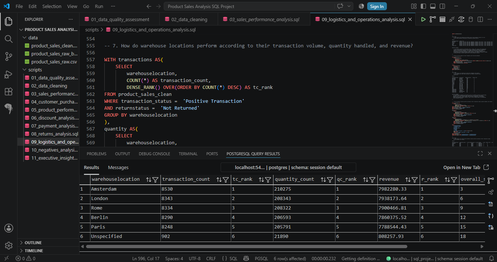

# Product-Sales-Analysis-Using-PostgreSQL (Version 1.0)
This project analyzes a multi-channel retail sales dataset using PostgreSQL to generate business insights on sales performance, customer behavior, product performance, discounts, payments, returns, logistics, and negative transactions. It showcases an end-to-end SQL  analytics workflow from data cleaning to executive-level business insights.

# Business Problem
Retail businesses generate thousands of transactions across multiple products, sales channels, payment methods, countries, and
logistics providers. While transactional data contains valuable business information, organizations often struggle to transform raw 
records into actionable insights.

This project addresses that challenge by analyzing sales transactions to answer practical business questions such as:

- Which products and categories generate the highest revenue?
- How do customers purchase across countries and sales channels?
- Do discounts increase sales performance?
- Which payment methods and shipment providers are most preferred?
- What factors are associated with product returns and negative transactions?
- What operational insights can support better business decisions?

# Objectives
This project aims to:

- Clean and prepare a retail sales dataset using PostgreSQL.
- Perform exploratory SQL analysis across multiple business dimensions.
- Measure sales performance, customer purchasing behavior, and product performance.
- Evaluate the effectiveness of discounts and payment methods.
- Analyze product return patterns and logistics performance.
- Investigate factors associated with negative transactions.
- Product executive-level business insights based on SQL analysis.

# Tools Used
- **Microsoft Excel** — Initial dataset inspection
- **pgAdmin 4** — Database administration and project setup
- **PostgreSQL** — SQL querying and data analysis
- **SQL** — Data cleaning, validation, and business analysis
- **AI** — Debugging, and technical writing support
- **GitHub** — Project documentation

# Dataset
- Records: 49,782 transactions
- Industry: Retail / E-commerce 
- Data includes:
  - **Products**
      - Backpack, Blue Pen, Desk Lamp, Headphones, Notebook, Office Chair, 
        T-shirt, USB Cable, Wall Clock, White Mug, Wireless Mouse
  - **Categories**
      - Accessories, Apparel, Electronics, Furniture, Stationery
  - **Sales Channels**
      - In-Store & Online
  - **Countries**
      - Australia, Belgium, France, Germany, Italy, Netherlands, Norway, 
        Portugal, Spain, Sweden, United Kingdom, United States
  - **Payment Methods**
      - Bank Transfer, Credit Card, PayPal
  - **Discounts**
      - High Discount, Medium Discount, Low Discount, No Discount
  - **Shipment Providers**
      - DHL, FedEx, Royal Mail, UPS
  - **Warehouse Locations**
      - Amsterdam, Berlin, London, Paris, Rome
  - **Returns**
      - Not Returned, Returned
  - **Order Priority**
      - High, Medium, Low

  # Project Workflow
  ```mermaid
  flowchart TD
      A[Raw Sales Dataset]
      B[Data Cleaning & Preparation]
      C[Data Validation]
      D[Exploratory SQL Analysis]
      E[Business Insights]
      F[Executive-Level Insights]

      A --> B
      B --> C
      C --> D
      D --> E
      E --> F
  ```
  # Repository Structure
  ```text
  product-sales-analysis/
  │
  ├── data/
  │   ├── raw/
  │   │   └── product_sales_raw.csv
  |   │   └── product_sales_raw_backup.csv
  │   └── cleaned/
  │       └── product_sales_clean.csv
  │
  ├── sql/
  │   ├── 01_data_quality_assessment.sql
  │   ├── 02_data_cleaning.sql
  │   ├── 03_sales_performance_analysis.sql
  │   ├── 04_customer_purchasing_behavior_analysis.sql
  │   ├── 05_product_performance_analysis.sql
  │   ├── 06_discount_analysis.sql
  │   ├── 07_payment_analysis.sql
  │   ├── 08_returns_analysis.sql
  │   ├── 09_logistics_and_operations_analysis.sql
  │   ├── 10_negatives_transaction_analysis.sql
  │   └── 11_executive_insights.sql
  │
  ├── README.md
  ```
# Project Development Snapshot
This project involved data cleaning, SQL query development, business analysis, and documentation over several months. The screenshot below shows part of my actual working environment while developing the project.



# SQL Preview
One of the analytical queries from this project combines multiple Common Table Expressions (CTEs), window functions, and ranking logic to evaluate warehouse performance across several business metrics.

```sql
WITH transactions AS(
    SELECT 
        warehouselocation,
        COUNT(*) AS transaction_count,
        DENSE_RANK() OVER(ORDER BY COUNT(*) DESC) AS tc_rank
    FROM product_sales_clean
    WHERE transaction_status = 'Positive Transaction'
      AND returnstatus = 'Not Returned'
    GROUP BY warehouselocation
),
quantity AS(
    SELECT
        warehouselocation,
        SUM(quantity) AS quantity_count,
        DENSE_RANK() OVER(ORDER BY SUM(quantity) DESC) AS qc_rank
    FROM product_sales_clean
    WHERE transaction_status = 'Positive Transaction'
      AND returnstatus = 'Not Returned'
    GROUP BY warehouselocation
),
revenue AS(
    SELECT
        warehouselocation,
        ROUND(SUM((quantity * unitprice) * (1 - discount)),2) AS revenue,
        DENSE_RANK() OVER(
            ORDER BY ROUND(SUM((quantity * unitprice) * (1 - discount)),2) DESC
        ) AS r_rank
    FROM product_sales_clean
    WHERE transaction_status = 'Positive Transaction'
      AND returnstatus = 'Not Returned'
    GROUP BY warehouselocation
)
SELECT
    t.warehouselocation,
    t.transaction_count,
    t.tc_rank,
    q.quantity_count,
    q.qc_rank,
    r.revenue,
    r.r_rank,
    (t.tc_rank + q.qc_rank + r.r_rank) AS overall_score,
    RANK() OVER(
        ORDER BY (t.tc_rank + q.qc_rank + r.r_rank)
    ) AS overall_rank
FROM transactions t
INNER JOIN quantity q
    ON t.warehouselocation = q.warehouselocation
INNER JOIN revenue r
    ON t.warehouselocation = r.warehouselocation;
```

  # Analysis Sections
  - **Data Quality Assessment**
  - **Data Cleaning**
  - **Sales Performance Analysis**
      - Business Questions
          - What is the total revenue generated?
          - What is the annual revenue performance?
          - What is the monthly revenue performance (seasonal performance)?
          - What is the year-month revenue trend?
          - Which categories contribute the largest percentage of total revenue?
          - How do product descriptions rank according to revenue generated?
          - How do products rank according to revenue within each category?
          - How do products rank per country according to revenues?
          - How do products rank according to country and year?
          - How do countries rank according to revenue (demand location)?
          - For every country, what is the top category and top product?
          - Which sales channel contributes the largest share of total revenue?
    
      - Summarized Key Findings
          - Total Revenue - 44.63 million
            | Revenue from returns - 4.36 million
            | Return rate - 9.76%
          - Revenue gap between products within the same category is relatively small.
            Moreover, product demands is distributed across multiple products rather than being 
            concentrated in a single product line.
          - Higher revenue categories appears to be associated with the number of products under it.
          - Revenue share is minimally influenced by sales channel.
          - Customers' product preferences is diversified per country over time.
          - The noticeable point anomaly in September 2025 is driven by a data coverage issue.
          - Overall, the business exhibits stable and well-distributed revenue performance 
            across time, products, countries, and sales channels. There is no major structural imbalances, 
            suggesting opportunities for optimization may lie in product assortment, pricing, or customer 
            segmentation rather than broad operational changes.
            
  - **Customer Purchasing Behavior Analysis**
      - Business Questions
          - What percentage of purchases are online transactions versus in-store transactions?
          - Which sales channel is preferred by transaction count according to product category (all years)?
          - Which sales channel is preferred by average quantity sold per transaction according to product category?
          - How do product categories rank on online purchases by transaction count and quantity sold?
          - How do product categories rank on in-store purchases by transaction count and quantity sold?
          - Which countries generated the highest number of online purchases and highest number of in-store purchases?
          - How do countries rank for overall number of transactions (online & in-store)?
            
      - Summarized Key Findings
          - Online and In-Store purchases are consistently distributed across transaction volume,
            product categories, products, and customer countries. Although Online purchases frequently
            rank first, the differences from In-Store purchases remain small, indicating no clear
            dominance of either sales channel.
          - Categories with a greater number of product lines generally generate higher transaction
            volumes and revenue. Electronics and Furniture, which contain more products than the other
            categories, consistently ranked among the top-performing categories across multiple analyses.

  - **Product Performance Analysis**
      - Business Questions
          - Which products have the highest sales volume?
          - Which products generate the highest revenue?
          - Which products have the highest average revenue per transaction?
          - Which products are top-ranked within each category?
          - What product is the top-performing per country?
          - Which products perform consistently across multiple countries?
          - Which categories contain the highest number of products sold?
          - Which categories generate the highest successful sales transactions?
          - How do category rankings change when returns are included?

      - Summarized Key Findings
          - Transaction volumes across individual products remain relatively consistent.
            Despite similar transaction counts, products differ in revenue generation, suggesting
            that pricing and average order value contribute more to revenue differences than sales
            volume alone.
          - Leading products vary across countries, with no single product consistently
            dominating global demand. At most, the same product ranked first in only three out of
            the twelve countries analyzed, indicating diverse purchasing preferences across markets.
          - Furniture and Electronics consistently ranked among the top-performing categories
            in terms of transaction volume, units sold, and revenue. This supports earlier findings
            that categories with a larger number of product lines generally exhibit stronger overall
            performance.
            
  - **Discount Analysis**
      - Business Questions
          - What is the average discount per category?
          - Does higher discount lead to higher sales quantity?
          - Which products receive discounts most frequently, and which products are most often sold without discounts?
          - Which categories rely most heavily on discounts?
          - What is the relationship between discount and revenue?
          - What is the relationship between discount and returns?
  
      - Summarized Key Findings
          - High discount offerings are associated with substantially higher transaction
            counts, greater total quantity sold, and higher overall revenue. Results suggest
            that increased sales volume is more likely driven by the greater number of customer
            transactions rather than higher quantities purchased per transaction.
          - Discount practices are consistently applied across products and categories.
            Discount usage rates, average discount values, and discount frequencies remain
            relatively uniform, suggesting that differences in product and category performance
            are unlikely to be explained by discount strategies alone.
          - Return rates remain relatively consistent across all discount levels, with only
            small percentage-point differences. These findings suggest that discount offerings
            show minimal association with product return behavior despite their association with
            higher sales volume.
            
  - **Payment Analysis**
      - Business Questions
          - Which payment methods are most preferred by customers?
          - Do top-payment method preferences differ by country?
          - How do payment methods rank according to country preference?
          - Do payment preferences differ by category?
          - How do payment methods rank according to preferences across online/in-store purchase?
          - Which payment methods generate the highest average transaction value?
          - Does order priority affect payment method preference
            
      - Summarized Key Findings
          - Bank Transfer consistently ranked first across transaction count, total product
            purchases, and revenue. It also ranked first in both Online and In-Store purchases
            and was the most preferred payment method in seven out of the twelve countries
            analyzed. Despite leading across multiple business metrics, differences among the
            three payment methods remained small, indicating that customer payment preferences
            are broadly distributed with no clear dominant payment method.
          - Payment method preferences remain relatively consistent across product categories.
            Transaction shares for Bank Transfer, Credit Card, and PayPal are closely distributed
            within each category, suggesting that product categories have minimal association
            with customers' choice of payment method.
          -  Payment method rankings vary across order priorities, with Credit Card leading
            High-priority orders while Bank Transfer leads Medium- and Low-priority orders.
            However, preference counts remain relatively close across all payment methods,
            suggesting no clear association between order priority and customers' payment
            method preferences.

  - **Returns Analysis**
      - Business Questions
          - What is the overall return rate?
          - How do categories rank on their return rates?
          - Which products have the highest return rates?
          - Are online purchases returned more often than in-store purchases?
          - What is the return rate per category for online purchases?
          - What is the return rate per category for in-store purchases?
          - Which countries have the highest return rates?
          - Does discount level influence return rate?
          - Does order priority influence return rates?
          - Which payment methods are associated with the highest return rates?
          - Which shipment providers have the highest return rates?
          - Do returned purchases always correspond to negative transactions?

      - Summarized Key Findings
          - Overall return rates remain consistently close to 10%, equivalent to approximately
            one return for every ten positive transactions. Across products, categories, countries,
            sales channels, discount levels, order priorities, payment methods, and shipment
            providers, return rates exhibit only small percentage-point differences, indicating
            that customer returns are broadly distributed rather than concentrated within a
            specific business segment.
          - Although Stationery, Notebook, Australia, Bank Transfer, DHL, High-priority orders,
            and No Discount transactions ranked first within their respective analyses, their
            return rates exceed the lowest-ranked groups by only small margins. These findings
            suggest that the ranking differences are not substantial enough to indicate a clear
            operational or customer-related return issue.
          - Returned purchases occur under both positive and negative transaction statuses.
            Positive transactions recorded a return rate of 9.82%, while negative transactions
            recorded 9.96%, differing by only 0.14 percentage points. This further supports the
            overall finding that returns remain consistently distributed across transaction types
            and show no meaningful association with any single business factor evaluated.
            
  - **Logistics and Operations Analysis**
      - Business Questions
          - How do shipment providers rank according to transactions, quantity, and revenue for OVERALL purchases?
          - How do shipment providers perform on ONLINE purchases according to transaction, quantity, and revenue?
          - How do shipment providers perform on IN-STORE purchases according to transaction, quantity, and revenue?
          - Does order priority affect shipment provider preference
          - How do shipment providers' transaction volume, quantity handled, and revenue compare according to RETURNS?
          - How do shipment providers rank based on their OVERALL RETURN rates and PER SALES CHANNEL RETURN rates?
          - Which products have been sold through each warehouse location?
          - Which top three products are most frequently sold from each warehouse?
          - How do warehouse locations perform according to their transaction volume, quantity handled, and revenue?
          - How do warehouse locations' transaction volume, quantity handled, and revenue compare according to RETURNS?
          - How do warehouse locations rank based on their OVERALL RETURN rates and PER SALES CHANNEL RETURN rates?
          - How do warehouse location preferences differ across customers' countries of origin?
  
      - Summarized Key Findings
          - Shipment provider performance is broadly distributed across transaction volume,
            product quantity handled, revenue, and customer preferences. Although FedEx ranked
            first in overall operational performance while UPS led Online purchases, differences
            among shipment providers remained relatively small. Return rates also stayed within
            a narrow range, suggesting no shipment provider demonstrates a clear operational
            advantage or substantially higher return issue.
          - Warehouse operations appear to be consistently balanced. All specified warehouse
            locations maintain the same product assortment, while transaction volume, quantity
            handled, revenue, and returned transactions remain closely distributed across the
            major warehouses. Although Amsterdam ranked first in overall operational performance,
            performance differences were minimal, indicating no warehouse exhibits clear operational
            dominance.
          - Customer preferences for both shipment providers and warehouse locations vary across
            countries and order priorities. However, preference counts remain relatively consistent
            across the available options, suggesting that neither customer origin nor order priority
            shows a strong association with shipment provider or warehouse location selection.

  - **Negatives Transaction Analysis**
      - Business Questions
          - What percentage of all transactions are negative transactions?
          - Which categories have the highest negative transaction rates?
          - Which products generate the most negative transaction rates?
          - Are online purchases more likely to become negative transactions than in-store purchases?
          - Which countries have the highest negative transaction rates?
          - Which payment methods are associated with the highest negative transaction rates?
          - Does discount level influence negative transaction rates?
          - Which shipment providers are associated with the highest negative transaction rates?
          - Which warehouse locations are associated with the highest negative transaction rates?
          - Does order priority influence negative transaction rates?
          - How much revenue is associated with negative transactions?
          - What is the relationship between negative transactions and returns?
            
      - Summarized Key Findings
          - Negative transactions account for only 5% of the overall dataset, indicating
            that unsuccessful transactions represent a relatively small portion of business
            activity. Across product categories, products, sales channels, countries, payment
            methods, shipment providers, and order priorities, negative transaction rates
            remain relatively consistent with only small percentage-point differences.
            These findings suggest that negative transactions are generally distributed across
            the business rather than concentrated within a specific operational or customer
            segment.
          - High Discount transactions are the only business factor showing a noticeably
            higher negative transaction rate compared to the other groups analyzed. Unlike
            the relatively consistent patterns observed across other business dimensions,
            High Discount transactions recorded a substantially wider percentage-point
            difference. These findings suggest a potential association between larger
            discount offerings and the occurrence of negative transactions. However,
            this analysis identifies an association rather than causation, and further
            investigation is necessary to determine the underlying factors.
          - Although negative transactions account for 5% of all transactions, they
            represent only 2.51% of the revenue generated from positive transactions,
            indicating a relatively limited financial impact on the business. In addition,
            returned purchases occur at nearly identical rates under both positive and
            negative transaction statuses, suggesting no meaningful association between
            transaction status and product returns. Finally, because all negative
            transactions are assigned to the 'Unspecified' warehouse location, warehouse
            performance cannot be reliably evaluated using negative transaction records
            within this dataset.
  
# Executive Insights
- **Revenue is primarily driven by sales volume rather than product pricing.** Categories with more product lines, particularly **Furniture** and **Electronics**, consistently generated the highest transaction volume and revenue.

- **Customer purchasing behavior is broadly distributed.** Product demand, sales channel preferences, payment methods, shipment providers, and warehouse usage showed relatively balanced patterns, indicating no single option strongly dominates customer behavior.

- **High discount offerings are associated with higher sales performance.** Higher discounts correspond to greater transaction volume, units sold, and overall revenue. However, discount usage is consistently applied across products and categories, suggesting discount strategy alone does not explain overall product performance.

- **Product returns remain stable across the business.** Approximately **1 in every 10 positive transactions** resulted in a return, with only small differences across products, categories, countries, sales channels, payment methods, shipment providers, discount levels, and order priorities.

- **Negative transactions account for only 5% of all transactions** and represent approximately **2.51% of positive transaction revenue**, indicating a relatively limited financial impact. Most business dimensions exhibit consistently low negative transaction rates, although **High Discount** transactions showed a noticeably higher negative transaction rate and may warrant further investigation.

- **Overall, the business demonstrates balanced operational performance.** Sales, logistics, customer behavior, and product demand remain consistently distributed across multiple business dimensions, suggesting that future optimization efforts may be more effective when focused on pricing strategies, discount policies, customer segmentation, and product assortment rather than large-scale operational changes.

# SQL Skills Demonstrated
- CTEs
- Window Functions
- CASE Statements
- Aggregate Functions
- STRING_AGG()
- Date Functions
- Ranking Functions
- Conditional Aggregation
- Business KPI Calculations
- Revenue Analysis
- Return Rate Analysis
- Customer Segmentation
    
# Future Improvements
- Build an interactive Power BI dashboard
- Perform customer segmentation using RFM Analysis
- Develop sales forecasting models using Python
- Integrate SQL with Tableau/Power BI

# Data Source
- Dataset Title: Online Sales Dataset
- Website: Kaggle
- Author: Yusuf Delikkaya
- Source Link: https://www.kaggle.com/datasets/yusufdelikkaya/online-sales-dataset
- License: CCO: Public Domain
  
# Personal Reflection
Over the past few months, I learned that business analytics is far more than simply writing SQL queries. It requires a combination of 
technical skills, analytical thinking, patience, and a structured approach to data cleaning, validation, and business analysis. Throughout this project, I realized that data cleaning is one of the most critical stages of the analytics process because the quality of 
the analysis ultimately depends on the quality of the data.

As a beginner in SQL, constructing queries was initially challenging. I had to understand not only the syntax but also the logic behind 
each query and how different SQL operations affected the results. To strengthen my skills, I used AI as a debugging assistant and practice partner by solving progressively challenging SQL exercises. This approach significantly improved both my SQL proficiency and my 
confidence in approaching analytical problems.

Coming from a Physics background, I also found it challenging to transition from writing detailed scientific reports to producing 
concise, business-focused analyses. Learning to formulate meaningful business questions, interpret query results, and synthesize findings
into actionable business insights required a different way of thinking. Developing executive-level insights was particularly demanding
because it involved reviewing results across multiple analyses and identifying meaningful relationships between different business metrics rather than simply describing individual query outputs.

Overall, this project has been one of the most rewarding milestones in my upskilling journey. It challenged both my technical and 
analytical abilities while teaching me how to transform raw transactional data into business insights that support data-driven decision-making. Completing this project has strengthened my confidence as an aspiring data analyst, and I am grateful for the oppotunity to develop a skill that I have worked hard to build.

# Feedback
I'm continuously improving my SQL and analytics skills. If you have suggestions on improving the SQL logic, business
interpretation, or overall project structure, I'd genuinely appreciate your feedback. Constructive discussions are always welcome.
  
